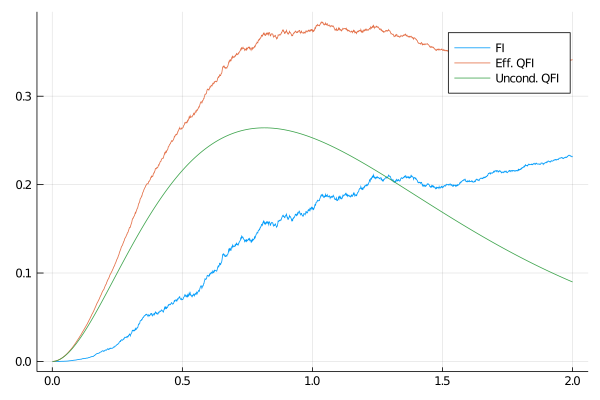

# QContinuousMeasurement
[](https://zenodo.org/badge/latestdoi/255846594)
[-%23517e66)](https://doi.org/10.1103/PhysRevLett.125.200505)
[](https://arxiv.org/abs/2006.08974)

## Installation

Requires Julia v1.0.

From the Julia REPL, open the package manager with the key `]` and run the command

```julia
pkg> add https://github.com/matteoacrossi/QContinuousMeasurement.jl
```

This will install all the dependencies, including a Python environment with [QuTiP](http://www.qutip.org).

To make local changes to the package, use

```julia
pkg> dev QContinuousMeasurement
```

## Usage

First, we initialize a `ModelParameters` object.

```julia
params = ModelParameters(Nj=3,
                         kind=1.0,
                         Gamma=1.0,
                         omega=1.0,
                         eta=1.0,
                         dt=0.001,
                         Tfinal=2.0,
                         outpoints=200)
```

Then, we can initialize a `LocalDephasingModel` object and a `State` object (in this case, a coherent spin state).

```julia
model = LocalDephasingModel(params)
initial_state = coherentspinstate(model)
```

To simulate one trajectory run

```julia
result = simulate_trajectory(model, initial_state);
```

To plot the FI for the trajectory, use

```julia
using Plots
plot(get_time(model), result.FI)
```

To run simulations with large numbers of trajectories, and for saving to `.h5`,
use the `script/simulate.jl` script. The script can be modified as needed.

The old interface of ContinuousMeasurementFI still works for calculating averages.

## Usage (old interface)

This will evaluate the effective QFI for 3 spins with 100 trajectories and compare it with the unconditional dynamics

```julia
using QContinuousMeasurement

result = Eff_QFI_HD_Dicke(3, 100, 2., 0.001)

result_uncond = Unconditional_QFI_Dicke(3, 2., 0.001)
```

This will produce the following plot
```julia
using Plots
plot(result.t, result.FI, label="FI")
plot!(result.t, result.FI + result.QFI, label="Eff. QFI")
plot!(result_uncond.t, result_uncond.QFI, label="Uncond. QFI")
```




`result` also contains the expectation values for the global operators `jx`, `jy`, `jz` and their variances `Δjx`, `Δjy`, `Δjz`,
and a `timer` object showing detailed timing information.

## Known issues
If you obtain the following error when importing `QContinuousMeasurement`:

    /usr/bin/../lib64/libstdc++.so.6: version `CXXABI_1.3.9' not found

run the following before starting Julia:

    export LD_PRELOAD=$HOME/.julia/conda/3/lib/libstdc++.so
    
## Citation
This code has been developed for the following preprint:

[Matteo A. C. Rossi, Francesco Albarelli, Dario Tamascelli, Marco G. Genoni, "Noisy quantum metrology enhanced by continuous nondemolition measurement", Phys. Rev. Lett. 125, 200505 (2020)](https://journals.aps.org/prl/abstract/10.1103/PhysRevLett.125.200505)

Please cite it if you are using this code.
